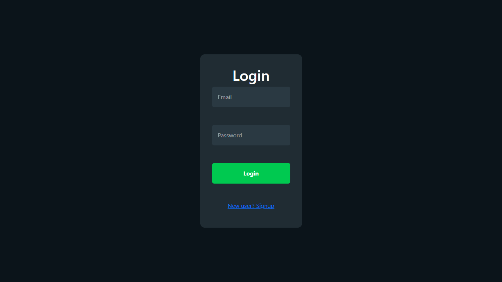
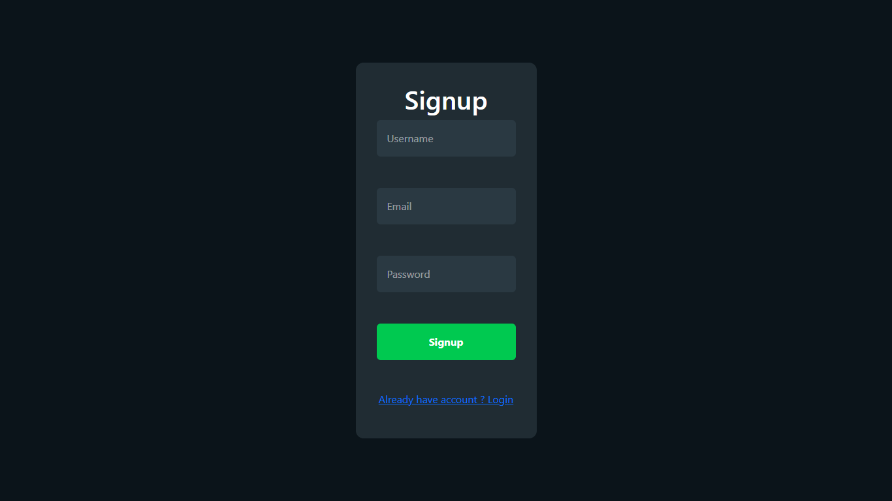
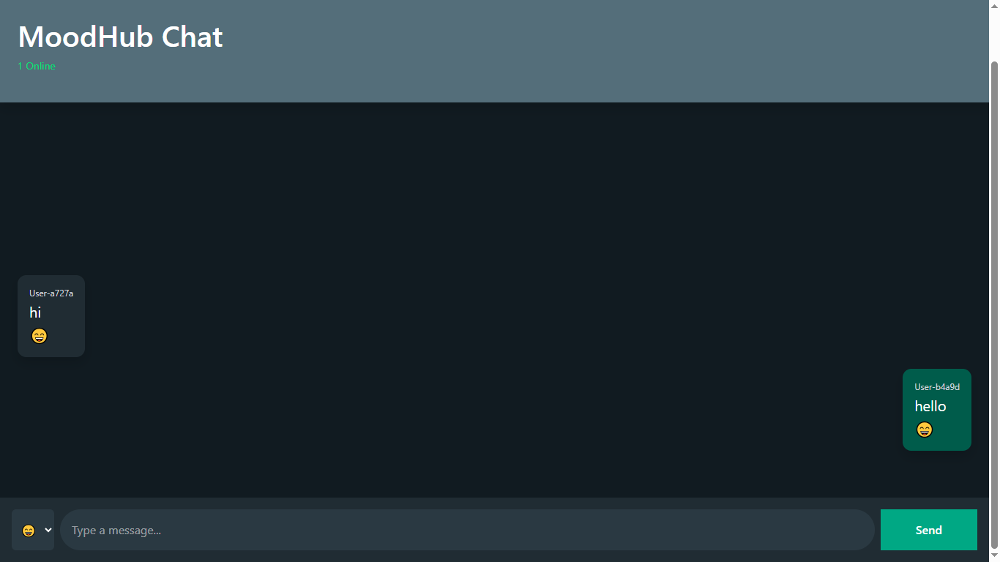
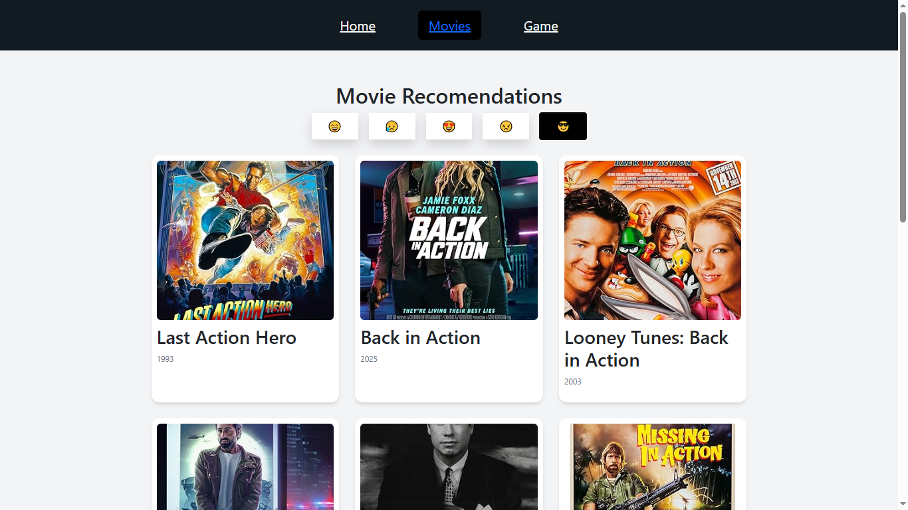
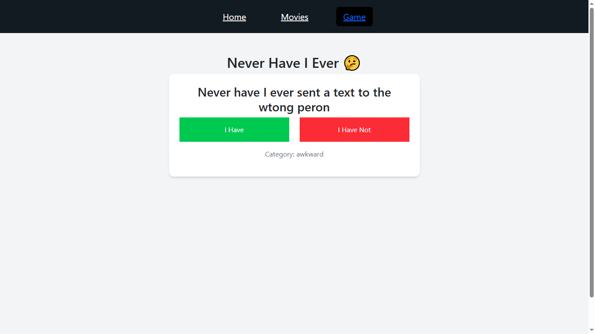

# MoodHub

MoodHub is a MERN Stack web application where users can anonymously share confessions, 
chat in real-time, discover movies based on mood, and play fun social games.

---

## Features

### Authentication
- User Signup
- User Login
- JWT Authentication
- Protected Routes
- Password Hashing using bcrypt

### Confessions
- Anonymous Posting
- Real-time Updates using Socket.io
- Online User Count
- Typing Indicator
- Mood Emojis

### Movies
- Mood-Based Movie Suggestions
- OMDb API Integration

### Games
- Never Have I Ever
- Random Question Generator
- MongoDB Question Storage

---

## Tech Stack

### Frontend
- React
- React Router
- Tailwind CSS
- Axios
- Socket.io Client

### Backend
- Node.js
- Express.js
- MongoDB
- Mongoose
- JWT
- bcrypt
- Socket.io

---

## Installation

### Backend

```bash
cd Backend
npm install
npm run dev
```

### Frontend

```bash
cd Frontend
npm install
npm run dev
```

---

## Environment Variables

Create a .env file inside Backend:

```env
MONGO_URL=your_mongodb_url
JWT_SECRET=your_secret_key
OMDB_API_KEY=your_api_key
PORT=5000
```

---

## Screenshots

## Login



## Signup



## Home



## Movies



## Game



---

## Author

Namrata Ponda